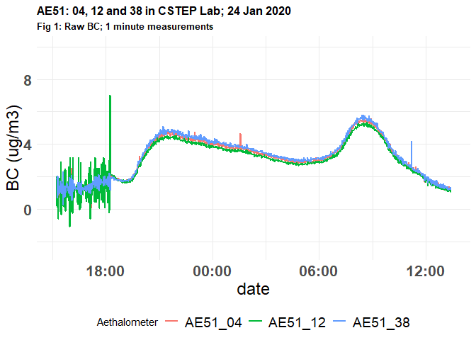
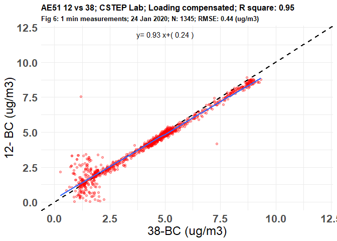

Exp-7: AE51 Colocation
================
Adithi
30 January 2020

As per AethLabs microaethalometer measurements have a noise when
measuring while it is being charged, for this experiment the chager was
removed at \~18:30 hrs. Also all the measurements where ATN values above
120 were discarded, Status zero was only used.

``` r
trial<- read.csv("D:/Dropbox/APMfull/Colocation CSTEP/CSTEP_co-location_2020/Exp_7_2020_01_24/2020_01_24_h150100_CSTEP_AE12.csv", header=TRUE, skip = 16, sep=",")

trial$date <- with(trial, as.POSIXct(paste(as.Date(Date, format="%Y/%m/%d"), Time)))
ef<-data.frame(trial)
ef$BC<-(ef$BC/1000)
ef<-ef[ef$ATN <= 120,]
ef<-ef[ef$Status <= 0,]
BC<-data.frame(ef$date,ef$BC)
colnames(BC) <- c( "date", "AE12")


trial2<- read.csv("D:/Dropbox/APMfull/Colocation CSTEP/CSTEP_co-location_2020/Exp_7_2020_01_24/2020_01_24_h150100_CSTEP_AE04.csv", header=TRUE, skip = 16, sep=",")

trial2$date <- with(trial2, as.POSIXct(paste(as.Date(Date, format="%Y/%m/%d"), Time)))
ef2<-data.frame(trial2)
ef2$BC<-(ef2$BC/1000)
ef2<-ef2[ef2$ATN <= 120,]
ef2<-ef2[ef2$Status <= 0,]
BC2<-data.frame(ef2$date,ef2$BC)
colnames(BC2) <- c( "date", "AE04")

BC<-data.table(BC)
setkey(BC, date)

BC2<-data.table(BC2)
setkey(BC2, date)

Final_AE1204<-BC[BC2, roll = "nearest"]  # the i part is for the table inside here 
#keep the table with greater number of rows keep bigger table inside for more rows and it comes with i

Final_AE1204<-dplyr::select(Final_AE1204, date, AE12, AE04)
names(Final_AE1204)<-c("date","AE51_12", "AE51_04")  # keep track of names BC is S2 and BC2 is for S4 BC is the one with 
Final_AE1204<-data.table(Final_AE1204)
setkey(Final_AE1204, date)

trial2 <- read.csv("D:/Dropbox/APMfull/Colocation CSTEP/CSTEP_co-location_2020/Exp_7_2020_01_24/2020_01_24_h151400_CSTEP_AE38.csv", header=TRUE, skip = 16, sep=",")
trial2$date <- with(trial2, as.POSIXct(paste(as.Date(Date, format="%Y/%m/%d"), Time)))
ef2<-data.frame(trial2)
ef2$BC<-(ef2$BC/1000)
ef2<-ef2[ef2$ATN <= 120,]
ef2<-ef2[ef2$Status <= 0,]
BC2<-data.frame(ef2$date,ef2$BC)
colnames(BC2) <- c( "date", "AE38")

BC2<-data.table(BC2)
setkey(BC2, date)

Final_AE120438<-Final_AE1204[BC2, roll = "nearest"]  # the i part is for the table inside here 
#keep the table with greater number of rows keep bigger table inside for more rows and it comes with i

Final_AE120438<-dplyr::select(Final_AE120438, date, AE51_12, AE51_04, AE38)
names(Final_AE120438)<-c("date","AE51_12", "AE51_04", "AE51_38") 
```

``` r
Final_AE120438_melt<-melt(Final_AE120438, id="date", measure.vars = c("AE51_04", "AE51_12",  "AE51_38"))
names(Final_AE120438_melt)<-c("date", "Aethalometer", "AE51")
p_all.line_1<-ggplot(data=Final_AE120438_melt, aes(date, as.numeric(AE51), col=Aethalometer))+
  geom_line(size=1)+theme_minimal()+
  labs(title="AE51: 04, 12 and 38 in CSTEP Lab; 24 Jan 2020",
       subtitle = "Fig 1: Raw BC; 1 minute measurements",
       y="BC (ug/m3)",
       x="date")+ theme(legend.position = "bottom", legend.text=element_text(size=14),plot.title = element_text(size = 12, face = "bold"),plot.subtitle = element_text(size = 10, face = "bold"), axis.title = element_text(size=18),axis.text = element_text(size = 16, face = "bold"))+scale_x_datetime( date_labels = "%H:%M")+scale_y_continuous(limits = c(-2.5, 10))
p_all.line_1
```

<!-- -->

``` r
r<-summary(lm(Final_AE120438$AE51_12~Final_AE120438$AE51_38))
m<-lm(AE51_12~AE51_38, Final_AE120438)
s<-summary(m)
r$r.squared<-round(r$adj.r.squared, digits=2)
n<-nrow(Final_AE120438)
Final_AE120438$diffSq<-(Final_AE120438$AE51_12-Final_AE120438$AE51_38)*(Final_AE120438$AE51_12-Final_AE120438$AE51_38)
mean_diff_sqr<-mean(Final_AE120438$diffSq, na.rm = TRUE)
rmse<-sqrt(mean_diff_sqr)
rmse<-round(rmse, digits = 2)
p_correlation<-ggplot(data=Final_AE120438,
                      aes(x=AE51_38, y=AE51_12))+
  geom_abline(slope=1, intercept=0, color="black", size=0.8, linetype="dashed")+theme_minimal()+
  geom_point(alpha=0.3, color="red")+scale_y_continuous(limits = c(-2,10))+scale_x_continuous(limits = c(-2, 10))+  geom_smooth(method=lm, se=FALSE, formula = y~x)+  labs(x="38-BC (ug/m3)",
                                                         y= "12- BC (ug/m3)",
                                                         title=paste0("AE51 12 vs 38; CSTEP Lab; 24 Jan 2020; R2: ", r$r.squared),
                                                         subtitle= paste0("Fig 2: Raw BC; 1 min measurements;  N: ", n, "; RMSE: ", rmse, " (ug/m3)"))
p<-p_correlation+theme(legend.text=element_text(size=14),plot.subtitle = element_text(size = 10, face = "bold"),plot.title = element_text(size = 12, face = "bold"), axis.title = element_text(size=18),axis.text = element_text(size = 16, face = "bold"))+annotate("text", label = reg_eqn(s), x =5, y = 10)
p
```

<!-- -->

``` r
r<-summary(lm(Final_AE120438$AE51_12~Final_AE120438$AE51_04))
m<-lm(AE51_12~AE51_04, Final_AE120438)
s<-summary(m)
r$r.squared<-round(r$adj.r.squared, digits=2)
n<-nrow(Final_AE120438)
Final_AE120438$diffSq<-(Final_AE120438$AE51_12-Final_AE120438$AE51_04)*(Final_AE120438$AE51_12-Final_AE120438$AE51_04)
mean_diff_sqr<-mean(Final_AE120438$diffSq, na.rm = TRUE)
rmse<-sqrt(mean_diff_sqr)
rmse<-round(rmse, digits = 2)
p_correlation<-ggplot(data=Final_AE120438,
                      aes(x=AE51_04, y=AE51_12))+
  geom_abline(slope=1, intercept=0, color="black", size=0.8, linetype="dashed")+theme_minimal()+
  geom_point(alpha=0.3, color="red")+scale_y_continuous(limits = c(-2,10))+scale_x_continuous(limits = c(-2,10))+  geom_smooth(method=lm, se=FALSE, formula = y~x)+  labs(x="04-BC (ug/m3)",
                                                         y= "12- BC (ug/m3)",
                                                         title=paste0("AE51 12 vs 04; CSTEP Lab; 24 Jan 2020; R2: ", r$r.squared),
                                                         subtitle= paste0("Fig 3: Raw BC; 1 min measurements; N: ", n, "; RMSE: ", rmse, " (ug/m3)"))
p<-p_correlation+theme(legend.text=element_text(size=14),plot.subtitle = element_text(size = 10, face = "bold"),plot.title = element_text(size = 12, face = "bold"), axis.title = element_text(size=18),axis.text = element_text(size = 16, face = "bold"))+annotate("text", label = reg_eqn(s), x =5, y = 10)
p
```

<!-- -->

``` r
r<-summary(lm(Final_AE120438$AE51_38~Final_AE120438$AE51_04))
m<-lm(AE51_38~AE51_04, Final_AE120438)
s<-summary(m)
r$r.squared<-round(r$adj.r.squared, digits=2)
n<-nrow(Final_AE120438)
Final_AE120438$diffSq<-(Final_AE120438$AE51_38-Final_AE120438$AE51_04)*(Final_AE120438$AE51_38-Final_AE120438$AE51_04)
mean_diff_sqr<-mean(Final_AE120438$diffSq, na.rm = TRUE)
rmse<-sqrt(mean_diff_sqr)
rmse<-round(rmse, digits = 2)
p_correlation<-ggplot(data=Final_AE120438,
                      aes(x=AE51_04, y=AE51_38))+
  geom_abline(slope=1, intercept=0, color="black", size=0.8, linetype="dashed")+theme_minimal()+
  geom_point(alpha=0.3, color="red")+scale_y_continuous(limits = c(-2,10))+scale_x_continuous(limits = c(-2,10))+  geom_smooth(method=lm, se=FALSE, formula = y~x)+  labs(x="04-BC (ug/m3)",
                                                         y= "38- BC (ug/m3)",
                                                         title=paste0("AE51 04 vs 38; CSTEP Lab; 24 Jan 2020; R square: ", r$r.squared),
                                                         subtitle= paste0("Fig 4: Raw BC; 1 min measurements; N: ", n, "; RMSE: ", rmse, " (ug/m3)"))
p<-p_correlation+theme(legend.text=element_text(size=14),plot.subtitle = element_text(size = 10, face = "bold"),plot.title = element_text(size = 12, face = "bold"), axis.title = element_text(size=18),axis.text = element_text(size = 16, face = "bold"))+annotate("text", label = reg_eqn(s), x =5, y = 10)
p
```

<!-- -->

``` r
trial<- read.csv("D:/Dropbox/APMfull/Colocation CSTEP/CSTEP_co-location_2020/Exp_7_2020_01_24/2020_01_24_h150100_CSTEP_AE12.csv", header=TRUE, skip = 16, sep=",")
trial$Date <- with(trial, as.POSIXct(paste(as.Date(Date, format="%Y/%m/%d"), Time)))
ef<-data.frame(trial)
ef$BC1<-(ef$BC/1000)
ef<-ef[ef$ATN <= 120,]
ef<-ef[ef$Status <= 0,]
ef$Tr=exp(-ef$ATN/100)
ef$CF=1/(0.88*ef$Tr+0.12)
ef$BC_Final=ef$BC1*ef$CF
ef$BC_Final[ef$BC_Final<0]<-NA
ef$BC_Final<-as.numeric(ef$BC_Final)
BC<-data.frame(ef$Date,ef$BC_Final)
colnames(BC) <- c( "Date", "BC")
BC$Date<- as.POSIXct(BC$Date, format='%Y-%m-%d %H:%M:%S')
attributes(BC$Date)$tzone <- "Asia/Kolkata"
BC<-BC[!is.na(BC$BC), ]
colnames(BC) <- c( "Date", "AE12")
BC$Date<- as.POSIXct(BC$Date, format='%Y-%m-%d %H:%M:%S')
attributes(BC$Date)$tzone <- "Asia/Kolkata"


trial2<- read.csv("D:/Dropbox/APMfull/Colocation CSTEP/CSTEP_co-location_2020/Exp_7_2020_01_24/2020_01_24_h150100_CSTEP_AE04.csv", header=TRUE, skip = 16, sep=",")
trial2$Date <- with(trial2, as.POSIXct(paste(as.Date(Date, format="%Y/%m/%d"), Time)))
ef2<-data.frame(trial2)
ef2$BC1<-(ef2$BC/1000)
ef2<-ef2[ef2$ATN <= 120,]
ef2<-ef2[ef2$Status <= 0,]
ef2$Tr=exp(-ef2$ATN/100)
ef2$CF=1/(0.88*ef2$Tr+0.12)
ef2$BC_Final=ef2$BC1*ef2$CF
ef2$BC_Final[ef2$BC_Final<0]<-NA
ef2$BC_Final<-as.numeric(ef2$BC_Final)
BC2<-data.frame(ef2$Date,ef2$BC_Final)
colnames(BC2) <- c( "Date", "BC")
BC2$Date<- as.POSIXct(BC2$Date, format='%Y-%m-%d %H:%M:%S')
attributes(BC2$Date)$tzone <- "Asia/Kolkata"
BC2<-BC2[!is.na(BC2$BC), ]
colnames(BC2) <- c( "Date", "AE04")
BC2$Date<- as.POSIXct(BC2$Date, format='%Y-%m-%d %H:%M:%S')
attributes(BC2$Date)$tzone <- "Asia/Kolkata"


BC$Date_1<-as.numeric(BC$Date)
BC<-data.table(BC)
setkey(BC, Date_1)
BC2$Date_1<-as.numeric(BC2$Date)
BC2<-data.table(BC2)
setkey(BC2, Date_1)

Final_AE1204<-BC[BC2, roll = "nearest"]  # the i part is for the table inside here 
#keep the table with greater number of rows keep bigger table inside for more rows and it comes with i

Final_AE1204<-dplyr::select(Final_AE1204, Date, AE12, AE04)
names(Final_AE1204)<-c("date","AE51_12", "AE51_04")  # keep track of names BC is S2 and BC2 is for S4 BC is the one with 
Final_AE1204<-data.table(Final_AE1204)
setkey(Final_AE1204, date)
trial2 <- read.csv("D:/Dropbox/APMfull/Colocation CSTEP/CSTEP_co-location_2020/Exp_7_2020_01_24/2020_01_24_h151400_CSTEP_AE38.csv", header=TRUE, skip = 16, sep=",")
trial2$Date <- with(trial2, as.POSIXct(paste(as.Date(Date, format="%Y/%m/%d"), Time)))
ef2<-data.frame(trial2)
ef2$BC1<-(ef2$BC/1000)
ef2<-ef2[ef2$ATN <= 120,]
ef2<-ef2[ef2$Status <= 0,]
ef2$Tr=exp(-ef2$ATN/100)
ef2$CF=1/(0.88*ef2$Tr+0.12)
ef2$BC_Final=ef2$BC1*ef2$CF
ef2$BC_Final[ef2$BC_Final<0]<-NA
ef2$BC_Final<-as.numeric(ef2$BC_Final)
BC2<-data.frame(ef2$Date,ef2$BC_Final)
colnames(BC2) <- c( "Date", "BC")
BC2$Date<- as.POSIXct(BC2$Date, format='%Y-%m-%d %H:%M:%S')
attributes(BC2$Date)$tzone <- "Asia/Kolkata"
BC2<-BC2[!is.na(BC2$BC), ]
colnames(BC2) <- c( "Date", "AE38")
BC2$Date<- as.POSIXct(BC2$Date, format='%Y-%m-%d %H:%M:%S')
attributes(BC2$Date)$tzone <- "Asia/Kolkata"
BC2$Date_1<-as.numeric(BC2$Date)
BC2<-data.table(BC2)
setkey(BC2, Date)

Final_AE120438<-Final_AE1204[BC2, roll = "nearest"]  # the i part is for the table inside here 
#keep the table with greater number of rows keep bigger table inside for more rows and it comes with i

Final_AE120438<-dplyr::select(Final_AE120438, date, AE51_12, AE51_04, AE38)
names(Final_AE120438)<-c("date","AE51_12", "AE51_04", "AE51_38") 
```

``` r
Final_AE120438_melt<-melt(Final_AE120438, id="date", measure.vars = c( "AE51_04", "AE51_12",  "AE51_38"))
names(Final_AE120438_melt)<-c("date", "Aethalometer", "AE51")
p_all.line_1<-ggplot(data=Final_AE120438_melt, aes(date, as.numeric(AE51), col=Aethalometer))+
  geom_line(size=1)+theme_minimal()+
  labs(title="AE51: 12, 38 and 04 in CSTEP Lab; 24 Jan 2020",
       subtitle = "Fig 5: Loading compensated; 1 minute measurements",
       y="BC (ug/m3)",
       x="date")+ theme(legend.position = "bottom", legend.text=element_text(size=14),plot.title = element_text(size = 12, face = "bold"),plot.subtitle = element_text(size = 10, face = "bold"), axis.title = element_text(size=18),axis.text = element_text(size = 16, face = "bold"))
p_all.line_1+scale_y_continuous(limits = c(0,12))+scale_x_datetime( date_labels = "%H:%M")
```

<!-- -->

``` r
r<-summary(lm(Final_AE120438$AE51_12~Final_AE120438$AE51_38))
m<-lm(AE51_12~AE51_38, Final_AE120438)
s<-summary(m)
r$r.squared<-round(r$adj.r.squared, digits=2)
n<-nrow(Final_AE120438)
Final_AE120438$diffSq<-(Final_AE120438$AE51_12-Final_AE120438$AE51_38)*(Final_AE120438$AE51_12-Final_AE120438$AE51_38)
mean_diff_sqr<-mean(Final_AE120438$diffSq, na.rm = TRUE)
rmse<-sqrt(mean_diff_sqr)
rmse<-round(rmse, digits = 2)
p_correlation<-ggplot(data=Final_AE120438,
                      aes(x=AE51_38, y=AE51_12))+
  geom_abline(slope=1, intercept=0, color="black", size=0.8, linetype="dashed")+theme_minimal()+
  geom_point(alpha=0.3, color="red")+scale_y_continuous(limits = c(0, 12))+scale_x_continuous(limits = c(0, 12))+  geom_smooth(method=lm, se=FALSE, formula = y~x)+  labs(x="38-BC (ug/m3)",
                                                         y= "12- BC (ug/m3)",
                                                         title=paste0("AE51 12 vs 38; CSTEP Lab; Loading compensated; R square: ", r$r.squared),
                                                         subtitle= paste0("Fig 6: 1 min measurements; 24 Jan 2020; N: ", n, "; RMSE: ", rmse, " (ug/m3)"))
p<-p_correlation+theme(legend.text=element_text(size=14),plot.subtitle = element_text(size = 10, face = "bold"),plot.title = element_text(size = 12, face = "bold"), axis.title = element_text(size=18),axis.text = element_text(size = 16, face = "bold"))+annotate("text", label = reg_eqn(s), x =5, y = 12)
p
```

<!-- -->

``` r
r<-summary(lm(Final_AE120438$AE51_12~Final_AE120438$AE51_04))
m<-lm(AE51_12~AE51_04, Final_AE120438)
s<-summary(m)
r$r.squared<-round(r$adj.r.squared, digits=2)
n<-nrow(Final_AE120438)
Final_AE120438$diffSq<-(Final_AE120438$AE51_12-Final_AE120438$AE51_04)*(Final_AE120438$AE51_12-Final_AE120438$AE51_04)
mean_diff_sqr<-mean(Final_AE120438$diffSq, na.rm = TRUE)
rmse<-sqrt(mean_diff_sqr)
rmse<-round(rmse, digits = 2)
p_correlation<-ggplot(data=Final_AE120438,
                      aes(x=AE51_04, y=AE51_12))+
  geom_abline(slope=1, intercept=0, color="black", size=0.8, linetype="dashed")+theme_minimal()+
  geom_point(alpha=0.3, color="red")+scale_y_continuous(limits = c(0, 12))+scale_x_continuous(limits = c(0, 12))+  geom_smooth(method=lm, se=FALSE, formula = y~x)+  labs(x="04-BC (ug/m3)",
                                                         y= "12- BC (ug/m3)",
                                                         title=paste0("AE51 12 vs 04; CSTEP Lab; 24 Jan 2020; R square: ", r$r.squared),
                                                         subtitle= paste0("Fig 7: Loading compensated; 1 min measurements;  N: ", n, "; RMSE: ", rmse, " (ug/m3)"))
p<-p_correlation+theme(legend.text=element_text(size=14),plot.subtitle = element_text(size = 10, face = "bold"),plot.title = element_text(size = 12, face = "bold"), axis.title = element_text(size=18),axis.text = element_text(size = 16, face = "bold"))+annotate("text", label = reg_eqn(s), x =5, y = 12)
p
```

<!-- -->

``` r
r<-summary(lm(Final_AE120438$AE51_38~Final_AE120438$AE51_04))
m<-lm(AE51_38~AE51_04, Final_AE120438)
s<-summary(m)
r$r.squared<-round(r$adj.r.squared, digits=2)
n<-nrow(Final_AE120438)
Final_AE120438$diffSq<-(Final_AE120438$AE51_38-Final_AE120438$AE51_04)*(Final_AE120438$AE51_38-Final_AE120438$AE51_04)
mean_diff_sqr<-mean(Final_AE120438$diffSq, na.rm = TRUE)
rmse<-sqrt(mean_diff_sqr)
rmse<-round(rmse, digits = 2)
p_correlation<-ggplot(data=Final_AE120438,
                      aes(x=AE51_04, y=AE51_38))+
  geom_abline(slope=1, intercept=0, color="black", size=0.8, linetype="dashed")+theme_minimal()+
  geom_point(alpha=0.3, color="red")+scale_y_continuous(limits = c(0, 12))+scale_x_continuous(limits = c(0, 12))+  geom_smooth(method=lm, se=FALSE, formula = y~x)+  labs(x="04-BC (ug/m3)",
                                                         y= "38- BC (ug/m3)",
                                                         title=paste0("AE51 04 vs 38; CSTEP Lab; Loading compensated; R square: ", r$r.squared),
                                                         subtitle= paste0("Fig 8: 1 min measurements; 24 Jan 2020; N: ", n, "; RMSE: ", rmse, " (ug/m3)"))
p<-p_correlation+theme(legend.text=element_text(size=14),plot.subtitle = element_text(size = 10, face = "bold"),plot.title = element_text(size = 12, face = "bold"), axis.title = element_text(size=18),axis.text = element_text(size = 16, face = "bold"))+annotate("text", label = reg_eqn(s), x =5, y = 12)
p
```

<!-- -->

``` r
Final_AE1204381<-timeAverage(Final_AE120438, avg.time = "10 min")
Final_AE1204381<-data.frame(Final_AE1204381)
Final_AE120438_melt<-melt(Final_AE1204381, id="date", measure.vars = c( "AE51_04", "AE51_12",  "AE51_38"))
names(Final_AE120438_melt)<-c("date", "Aethalometer", "AE51")
p_all.line_1<-ggplot(data=Final_AE120438_melt, aes(date, as.numeric(AE51), col=Aethalometer))+
  geom_line(size=1)+theme_minimal()+
  labs(title="AE51: 12, 38 and 04 in CSTEP Lab; 24 Jan 2020",
       subtitle = "Fig 9: Loading compensated; 10 minute avg",
       y="BC (ug/m3)",
       x="date")+ theme(legend.position = "bottom", legend.text=element_text(size=14),plot.title = element_text(size = 12, face = "bold"),plot.subtitle = element_text(size = 10, face = "bold"), axis.title = element_text(size=18),axis.text = element_text(size = 16, face = "bold"))
p_all.line_1+scale_y_continuous(limits = c(0,12))+scale_x_datetime( date_labels = "%H:%M")
```

<!-- -->

``` r
Final_AE120438<-Final_AE1204381
r<-summary(lm(Final_AE120438$AE51_12~Final_AE120438$AE51_38))
m<-lm(AE51_12~AE51_38, Final_AE120438)
s<-summary(m)
r$r.squared<-round(r$adj.r.squared, digits=2)
n<-nrow(Final_AE120438)
Final_AE120438$diffSq<-(Final_AE120438$AE51_12-Final_AE120438$AE51_38)*(Final_AE120438$AE51_12-Final_AE120438$AE51_38)
mean_diff_sqr<-mean(Final_AE120438$diffSq, na.rm = TRUE)
rmse<-sqrt(mean_diff_sqr)
rmse<-round(rmse, digits = 2)
p_correlation<-ggplot(data=Final_AE120438,
                      aes(x=AE51_38, y=AE51_12))+
  geom_abline(slope=1, intercept=0, color="black", size=0.8, linetype="dashed")+theme_minimal()+
  geom_point(alpha=0.3, color="red")+scale_y_continuous(limits = c(0, 12))+scale_x_continuous(limits = c(0, 12))+  geom_smooth(method=lm, se=FALSE, formula = y~x)+  labs(x="38-BC (ug/m3)",
                                                         y= "12- BC (ug/m3)",
                                                         title=paste0("AE51 12 vs 38; CSTEP Lab; Loading compensated; R square: ", r$r.squared),
                                                         subtitle= paste0("Fig 10: 10 min avg; 24 Jan 2020; N: ", n, "; RMSE: ", rmse, " (ug/m3)"))
p<-p_correlation+theme(legend.text=element_text(size=14),plot.subtitle = element_text(size = 10, face = "bold"),plot.title = element_text(size = 12, face = "bold"), axis.title = element_text(size=18),axis.text = element_text(size = 16, face = "bold"))+annotate("text", label = reg_eqn(s), x =5, y = 12)
p
```

<!-- -->

``` r
Final_AE120438<-Final_AE1204381
r<-summary(lm(Final_AE120438$AE51_12~Final_AE120438$AE51_04))
m<-lm(AE51_12~AE51_04, Final_AE120438)
s<-summary(m)
r$r.squared<-round(r$adj.r.squared, digits=2)
n<-nrow(Final_AE120438)
Final_AE120438$diffSq<-(Final_AE120438$AE51_12-Final_AE120438$AE51_04)*(Final_AE120438$AE51_12-Final_AE120438$AE51_04)
mean_diff_sqr<-mean(Final_AE120438$diffSq, na.rm = TRUE)
rmse<-sqrt(mean_diff_sqr)
rmse<-round(rmse, digits = 2)
p_correlation<-ggplot(data=Final_AE120438,
                      aes(x=AE51_04, y=AE51_12))+
  geom_abline(slope=1, intercept=0, color="black", size=0.8, linetype="dashed")+theme_minimal()+
  geom_point(alpha=0.3, color="red")+scale_y_continuous(limits = c(0, 12))+scale_x_continuous(limits = c(0, 12))+  geom_smooth(method=lm, se=FALSE, formula = y~x)+  labs(x="04-BC (ug/m3)",
                                                         y= "12- BC (ug/m3)",
                                                         title=paste0("AE51 12 vs 04; CSTEP Lab; 24 Jan 2020; R square: ", r$r.squared),
                                                         subtitle= paste0("Fig 11: Loading compensated; 10 min avg;  N: ", n, "; RMSE: ", rmse, " (ug/m3)"))
p<-p_correlation+theme(legend.text=element_text(size=14),plot.subtitle = element_text(size = 10, face = "bold"),plot.title = element_text(size = 12, face = "bold"), axis.title = element_text(size=18),axis.text = element_text(size = 16, face = "bold"))+annotate("text", label = reg_eqn(s), x =5, y = 12)
p
```

<!-- -->

``` r
Final_AE120438<-Final_AE1204381
r<-summary(lm(Final_AE120438$AE51_38~Final_AE120438$AE51_04))
m<-lm(AE51_38~AE51_04, Final_AE120438)
s<-summary(m)
r$r.squared<-round(r$adj.r.squared, digits=2)
n<-nrow(Final_AE120438)
Final_AE120438$diffSq<-(Final_AE120438$AE51_38-Final_AE120438$AE51_04)*(Final_AE120438$AE51_38-Final_AE120438$AE51_04)
mean_diff_sqr<-mean(Final_AE120438$diffSq, na.rm = TRUE)
rmse<-sqrt(mean_diff_sqr)
rmse<-round(rmse, digits = 2)
p_correlation<-ggplot(data=Final_AE120438,
                      aes(x=AE51_04, y=AE51_38))+
  geom_abline(slope=1, intercept=0, color="black", size=0.8, linetype="dashed")+theme_minimal()+
  geom_point(alpha=0.3, color="red")+scale_y_continuous(limits = c(0, 12))+scale_x_continuous(limits = c(0, 12))+  geom_smooth(method=lm, se=FALSE, formula = y~x)+  labs(x="04-BC (ug/m3)",
                                                         y= "38- BC (ug/m3)",
                                                         title=paste0("AE51 04 vs 38; CSTEP Lab; Loading compensated; R square: ", r$r.squared),
                                                         subtitle= paste0("Fig 12: 10 min avg; 24 Jan 2020; N: ", n, "; RMSE: ", rmse, " (ug/m3)"))
p<-p_correlation+theme(legend.text=element_text(size=14),plot.subtitle = element_text(size = 10, face = "bold"),plot.title = element_text(size = 12, face = "bold"), axis.title = element_text(size=18),axis.text = element_text(size = 16, face = "bold"))+annotate("text", label = reg_eqn(s), x =5, y = 12)
p
```

<!-- -->

``` r
trial<- read.csv("D:/Dropbox/APMfull/Colocation CSTEP/CSTEP_co-location_2020/Exp_7_2020_01_24/2020_01_24_h150100_CSTEP_AE12.csv", header=TRUE, skip = 16, sep=",")

trial$date <- with(trial, as.POSIXct(paste(as.Date(Date, format="%Y/%m/%d"), Time)))
ef<-data.frame(trial)
ef$BC<-(ef$BC/1000)
ef<-ef[ef$ATN <= 120,]
ef<-ef[ef$Status <= 0,]
BC<-data.frame(ef$date,ef$ATN)
colnames(BC) <- c( "date", "ATN_12")


trial2<- read.csv("D:/Dropbox/APMfull/Colocation CSTEP/CSTEP_co-location_2020/Exp_7_2020_01_24/2020_01_24_h150100_CSTEP_AE04.csv", header=TRUE, skip = 16, sep=",")

trial2$date <- with(trial2, as.POSIXct(paste(as.Date(Date, format="%Y/%m/%d"), Time)))
ef2<-data.frame(trial2)
ef2$BC<-(ef2$BC/1000)
ef2<-ef2[ef2$ATN <= 120,]
ef2<-ef2[ef2$Status <= 0,]
BC2<-data.frame(ef2$date,ef2$ATN)
colnames(BC2) <- c( "date", "ATN_04")

BC<-data.table(BC)
setkey(BC, date)

BC2<-data.table(BC2)
setkey(BC2, date)

Final_AE1204<-BC[BC2, roll = "nearest"]  # the i part is for the table inside here 
#keep the table with greater number of rows keep bigger table inside for more rows and it comes with i

Final_AE1204<-dplyr::select(Final_AE1204, date, ATN_12, ATN_04)
names(Final_AE1204)<-c("date","ATN_12", "ATN_04")  # keep track of names BC is S2 and BC2 is for S4 BC is the one with 
Final_AE1204<-data.table(Final_AE1204)
setkey(Final_AE1204, date)

trial2 <- read.csv("D:/Dropbox/APMfull/Colocation CSTEP/CSTEP_co-location_2020/Exp_7_2020_01_24/2020_01_24_h151400_CSTEP_AE38.csv", header=TRUE, skip = 16, sep=",")
trial2$date <- with(trial2, as.POSIXct(paste(as.Date(Date, format="%Y/%m/%d"), Time)))
ef2<-data.frame(trial2)
ef2$BC<-(ef2$BC/1000)
ef2<-ef2[ef2$ATN <= 120,]
ef2<-ef2[ef2$Status <= 0,]
BC2<-data.frame(ef2$date,ef2$ATN)
colnames(BC2) <- c( "date", "ATN_38")

BC2<-data.table(BC2)
setkey(BC2, date)

Final_AE120438<-Final_AE1204[BC2, roll = "nearest"]  # the i part is for the table inside here 
#keep the table with greater number of rows keep bigger table inside for more rows and it comes with i

Final_AE120438<-dplyr::select(Final_AE120438, date, ATN_12, ATN_04, ATN_38)
names(Final_AE120438)<-c("date","ATN_12", "ATN_04", "ATN_38") 
```

``` r
Final_AE120438_melt<-melt(Final_AE120438, id="date", measure.vars = c("ATN_04", "ATN_12", "ATN_38"))
names(Final_AE120438_melt)<-c("date", "Aethalometer", "ATN")
p_all.line_1<-ggplot(data=Final_AE120438_melt, aes(date, as.numeric(ATN), col=Aethalometer))+
  geom_line(size=1)+theme_minimal()+
  labs(title="AE51: 04, 12 and 38 in CSTEP Lab; 24 Jan 2020",
       subtitle = "Fig 13: ATN; 1 minute measurements",
       y="BC (ug/m3)",
       x="date")+ theme(legend.position = "bottom", legend.text=element_text(size=14),plot.title = element_text(size = 12, face = "bold"),plot.subtitle = element_text(size = 10, face = "bold"), axis.title = element_text(size=18),axis.text = element_text(size = 16, face = "bold"))+scale_x_datetime( date_labels = "%H:%M")+scale_y_continuous(limits = c(-2.5, 100))
p_all.line_1
```

<!-- -->

``` r
trial<- read.csv("D:/Dropbox/APMfull/Colocation CSTEP/CSTEP_co-location_2020/Exp_7_2020_01_24/2020_01_24_h150100_CSTEP_AE12.csv", header=TRUE, skip = 16, sep=",")

trial$date <- with(trial, as.POSIXct(paste(as.Date(Date, format="%Y/%m/%d"), Time)))
ef<-data.frame(trial)
ef$BC<-(ef$BC/1000)
ef<-ef[ef$ATN <= 120,]
ef<-ef[ef$Status <= 0,]
BC<-data.frame(ef$date,ef$ATN)
colnames(BC) <- c( "date", "ATN_12")
BC$ATN_12<-BC$ATN_12-3.789

trial2<- read.csv("D:/Dropbox/APMfull/Colocation CSTEP/CSTEP_co-location_2020/Exp_7_2020_01_24/2020_01_24_h150100_CSTEP_AE04.csv", header=TRUE, skip = 16, sep=",")

trial2$date <- with(trial2, as.POSIXct(paste(as.Date(Date, format="%Y/%m/%d"), Time)))
ef2<-data.frame(trial2)
ef2$BC<-(ef2$BC/1000)
ef2<-ef2[ef2$ATN <= 120,]
ef2<-ef2[ef2$Status <= 0,]
BC2<-data.frame(ef2$date,ef2$ATN)
colnames(BC2) <- c( "date", "ATN_04")
BC2$ATN_04<-BC2$ATN_04-10.140


BC<-data.table(BC)
setkey(BC, date)

BC2<-data.table(BC2)
setkey(BC2, date)

Final_AE1204<-BC[BC2, roll = "nearest"]  # the i part is for the table inside here 
#keep the table with greater number of rows keep bigger table inside for more rows and it comes with i

Final_AE1204<-dplyr::select(Final_AE1204, date, ATN_12, ATN_04)
names(Final_AE1204)<-c("date","ATN_12", "ATN_04")  # keep track of names BC is S2 and BC2 is for S4 BC is the one with 
Final_AE1204<-data.table(Final_AE1204)
setkey(Final_AE1204, date)

trial2 <- read.csv("D:/Dropbox/APMfull/Colocation CSTEP/CSTEP_co-location_2020/Exp_7_2020_01_24/2020_01_24_h151400_CSTEP_AE38.csv", header=TRUE, skip = 16, sep=",")
trial2$date <- with(trial2, as.POSIXct(paste(as.Date(Date, format="%Y/%m/%d"), Time)))
ef2<-data.frame(trial2)
ef2$BC<-(ef2$BC/1000)
ef2<-ef2[ef2$ATN <= 120,]
ef2<-ef2[ef2$Status <= 0,]
BC2<-data.frame(ef2$date,ef2$ATN)
colnames(BC2) <- c( "date", "ATN_38")
BC2$ATN_38<-BC2$ATN_38-(-4.564)

BC2<-data.table(BC2)
setkey(BC2, date)

Final_AE120438<-Final_AE1204[BC2, roll = "nearest"]  # the i part is for the table inside here 
#keep the table with greater number of rows keep bigger table inside for more rows and it comes with i

Final_AE120438<-dplyr::select(Final_AE120438, date, ATN_12, ATN_04, ATN_38)
names(Final_AE120438)<-c("date","ATN_12", "ATN_04", "ATN_38") 
```

``` r
Final_AE120438_melt<-melt(Final_AE120438, id="date", measure.vars = c("ATN_04", "ATN_12", "ATN_38"))
names(Final_AE120438_melt)<-c("date", "Aethalometer", "ATN")
p_all.line_1<-ggplot(data=Final_AE120438_melt, aes(date, as.numeric(ATN), col=Aethalometer))+
  geom_line(size=1)+theme_minimal()+
  labs(title="Corrected ATN AE51: 04, 12 and 38 in CSTEP Lab; 24 Jan 2020",
       subtitle = "Fig 14: ATN; 1 minute measurements",
       y="BC (ug/m3)",
       x="date")+ theme(legend.position = "bottom", legend.text=element_text(size=14),plot.title = element_text(size = 12, face = "bold"),plot.subtitle = element_text(size = 10, face = "bold"), axis.title = element_text(size=18),axis.text = element_text(size = 16, face = "bold"))+scale_x_datetime( date_labels = "%H:%M")+scale_y_continuous(limits = c(-2.5, 100))
p_all.line_1
```

<!-- -->

``` r
trial<- read.csv("D:/Dropbox/APMfull/Colocation CSTEP/CSTEP_co-location_2020/Exp_7_2020_01_24/2020_01_24_h150100_CSTEP_AE12.csv", header=TRUE, skip = 16, sep=",")
trial$Date <- with(trial, as.POSIXct(paste(as.Date(Date, format="%Y/%m/%d"), Time)))
ef<-data.frame(trial)
ef$BC1<-(ef$BC/1000)
ef<-ef[ef$ATN <= 120,]
ef<-ef[ef$Status <= 0,]
ef$ATN<-ef$ATN-3.789
ef$Tr=exp(-ef$ATN/100)
ef$CF=1/(0.88*ef$Tr+0.12)
ef$BC_Final=ef$BC1*ef$CF
ef$BC_Final[ef$BC_Final<0]<-NA
ef$BC_Final<-as.numeric(ef$BC_Final)
BC<-data.frame(ef$Date,ef$BC_Final)
colnames(BC) <- c( "Date", "BC")
BC$Date<- as.POSIXct(BC$Date, format='%Y-%m-%d %H:%M:%S')
attributes(BC$Date)$tzone <- "Asia/Kolkata"
BC<-BC[!is.na(BC$BC), ]
colnames(BC) <- c( "Date", "AE12")
BC$Date<- as.POSIXct(BC$Date, format='%Y-%m-%d %H:%M:%S')
attributes(BC$Date)$tzone <- "Asia/Kolkata"


trial2<- read.csv("D:/Dropbox/APMfull/Colocation CSTEP/CSTEP_co-location_2020/Exp_7_2020_01_24/2020_01_24_h150100_CSTEP_AE04.csv", header=TRUE, skip = 16, sep=",")
trial2$Date <- with(trial2, as.POSIXct(paste(as.Date(Date, format="%Y/%m/%d"), Time)))
ef2<-data.frame(trial2)
ef2$BC1<-(ef2$BC/1000)
ef2<-ef2[ef2$ATN <= 120,]
ef2<-ef2[ef2$Status <= 0,]
ef2$ATN<-ef2$ATN-10.140
ef2$Tr=exp(-ef2$ATN/100)
ef2$CF=1/(0.88*ef2$Tr+0.12)
ef2$BC_Final=ef2$BC1*ef2$CF
ef2$BC_Final[ef2$BC_Final<0]<-NA
ef2$BC_Final<-as.numeric(ef2$BC_Final)
BC2<-data.frame(ef2$Date,ef2$BC_Final)
colnames(BC2) <- c( "Date", "BC")
BC2$Date<- as.POSIXct(BC2$Date, format='%Y-%m-%d %H:%M:%S')
attributes(BC2$Date)$tzone <- "Asia/Kolkata"
BC2<-BC2[!is.na(BC2$BC), ]
colnames(BC2) <- c( "Date", "AE04")
BC2$Date<- as.POSIXct(BC2$Date, format='%Y-%m-%d %H:%M:%S')
attributes(BC2$Date)$tzone <- "Asia/Kolkata"


BC$Date_1<-as.numeric(BC$Date)
BC<-data.table(BC)
setkey(BC, Date_1)
BC2$Date_1<-as.numeric(BC2$Date)
BC2<-data.table(BC2)
setkey(BC2, Date_1)

Final_AE1204<-BC[BC2, roll = "nearest"]  # the i part is for the table inside here 
#keep the table with greater number of rows keep bigger table inside for more rows and it comes with i

Final_AE1204<-dplyr::select(Final_AE1204, Date, AE12, AE04)
names(Final_AE1204)<-c("date","AE51_12", "AE51_04")  # keep track of names BC is S2 and BC2 is for S4 BC is the one with 
Final_AE1204<-data.table(Final_AE1204)
setkey(Final_AE1204, date)
trial2 <- read.csv("D:/Dropbox/APMfull/Colocation CSTEP/CSTEP_co-location_2020/Exp_7_2020_01_24/2020_01_24_h151400_CSTEP_AE38.csv", header=TRUE, skip = 16, sep=",")
trial2$Date <- with(trial2, as.POSIXct(paste(as.Date(Date, format="%Y/%m/%d"), Time)))
ef2<-data.frame(trial2)
ef2$BC1<-(ef2$BC/1000)
ef2<-ef2[ef2$ATN <= 120,]
ef2<-ef2[ef2$Status <= 0,]
ef2$ATN<-ef2$ATN-(-4.564)
ef2$Tr=exp(-ef2$ATN/100)
ef2$CF=1/(0.88*ef2$Tr+0.12)
ef2$BC_Final=ef2$BC1*ef2$CF
ef2$BC_Final[ef2$BC_Final<0]<-NA
ef2$BC_Final<-as.numeric(ef2$BC_Final)
BC2<-data.frame(ef2$Date,ef2$BC_Final)
colnames(BC2) <- c( "Date", "BC")
BC2$Date<- as.POSIXct(BC2$Date, format='%Y-%m-%d %H:%M:%S')
attributes(BC2$Date)$tzone <- "Asia/Kolkata"
BC2<-BC2[!is.na(BC2$BC), ]
colnames(BC2) <- c( "Date", "AE38")
BC2$Date<- as.POSIXct(BC2$Date, format='%Y-%m-%d %H:%M:%S')
attributes(BC2$Date)$tzone <- "Asia/Kolkata"
BC2$Date_1<-as.numeric(BC2$Date)
BC2<-data.table(BC2)
setkey(BC2, Date)

Final_AE120438<-Final_AE1204[BC2, roll = "nearest"]  # the i part is for the table inside here 
#keep the table with greater number of rows keep bigger table inside for more rows and it comes with i

Final_AE120438<-dplyr::select(Final_AE120438, date, AE51_12, AE51_04, AE38)
names(Final_AE120438)<-c("date","AE51_12", "AE51_04", "AE51_38") 
```

``` r
Final_AE1204381<-timeAverage(Final_AE120438, avg.time = "10 min")
Final_AE1204381<-data.frame(Final_AE1204381)
Final_AE120438_melt<-melt(Final_AE1204381, id="date", measure.vars = c( "AE51_04", "AE51_12",  "AE51_38"))
names(Final_AE120438_melt)<-c("date", "Aethalometer", "AE51")
p_all.line_1<-ggplot(data=Final_AE120438_melt, aes(date, as.numeric(AE51), col=Aethalometer))+
  geom_line(size=1)+theme_minimal()+
  labs(title="AE51: 12, 38 and 04 with corrected ATN in CSTEP Lab; 24 Jan 2020",
       subtitle = "Fig 15: Loading compensated; 10 minute avg",
       y="BC (ug/m3)",
       x="date")+ theme(legend.position = "bottom", legend.text=element_text(size=14),plot.title = element_text(size = 12, face = "bold"),plot.subtitle = element_text(size = 10, face = "bold"), axis.title = element_text(size=18),axis.text = element_text(size = 16, face = "bold"))
p_all.line_1+scale_y_continuous(limits = c(0,12))+scale_x_datetime( date_labels = "%H:%M")
```

<!-- -->
